C107 配布基板サポート
今宵＠たまはい　で頒布した基板の説明です。

使ってみた

 

## マイコンをさす想定
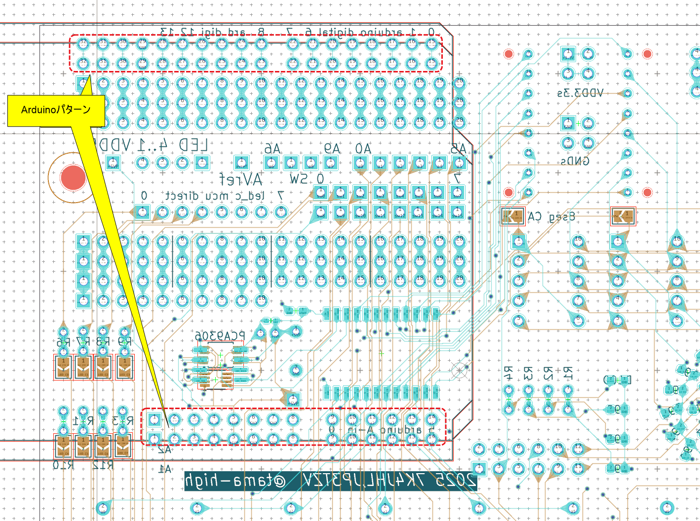 
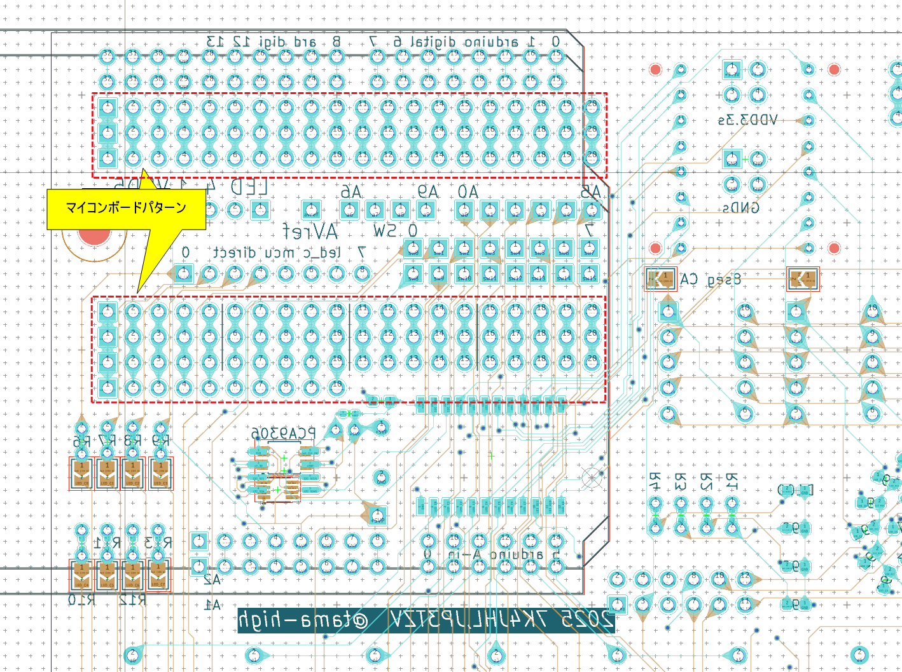 
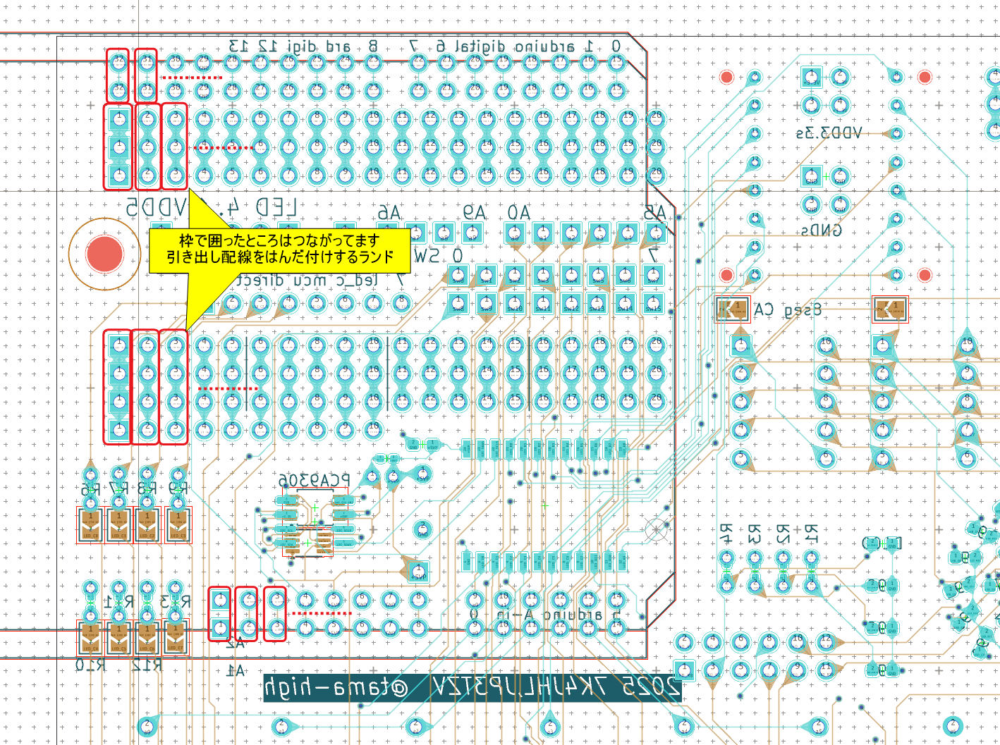 

Arduinoならこんな感じ

# GND, 3.3V
 
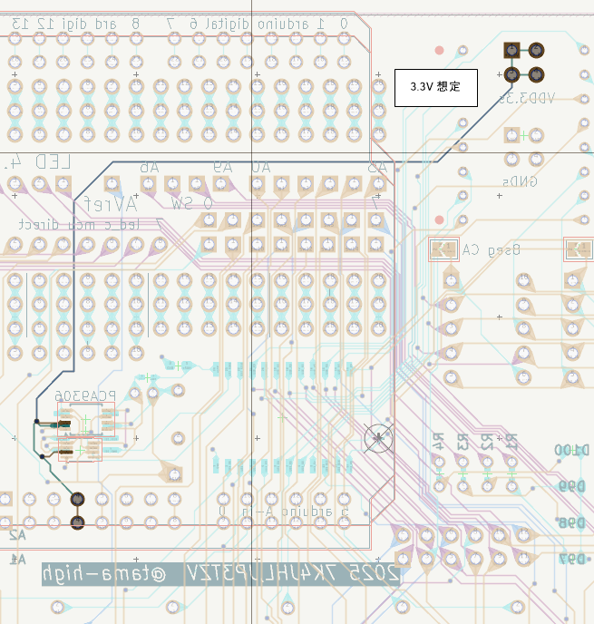 

# スイッチ、可変抵抗
可変抵抗
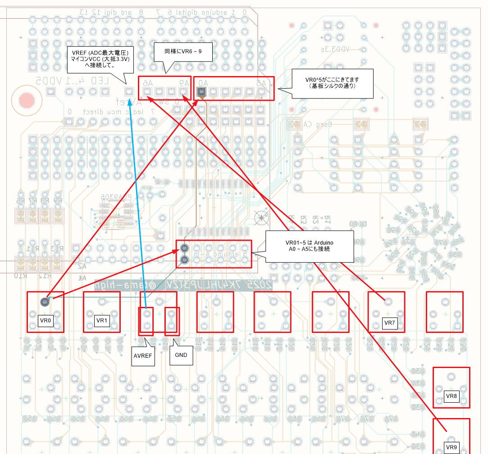 

スイッチ

内部プルアップされたGPIOにつなぐ想定

スイッチのパターンの片方はGNDに接続済みです。

使うスイッチがどう結線されてるか確認してね

記事最初の写真のように、千鳥に配置できるパターンです。

# ユニバーサルパターン
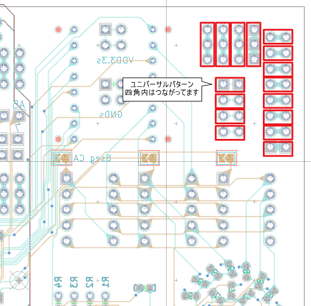 
LCDやoled接続にも。

# LEDドライバ(HT33K16を使う場合)
マイコンが3.3V動作であることを想定し、PCA9306のI2Cレベルシフタを使います。

この場合、3.3V（マイコン）側のI2Cのプルアップは無し、  
5V側のSDA,SCLを1kΩで5Vにプルアップしてください。

こんな感じ

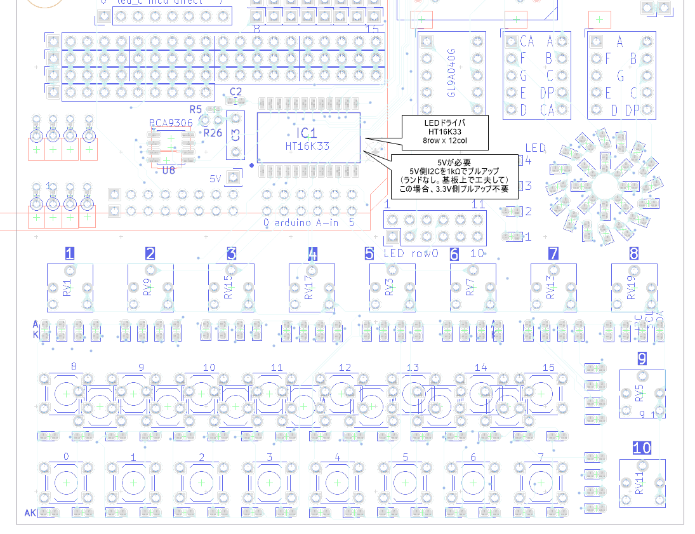 

PCA9306にはパッケージ違いがあるので、好きなのを使ってください。
!!! 同じパッケージでピン配置違いがあります。対応してないのは…ごめんなさい
（表面に実装できるパッケージ）
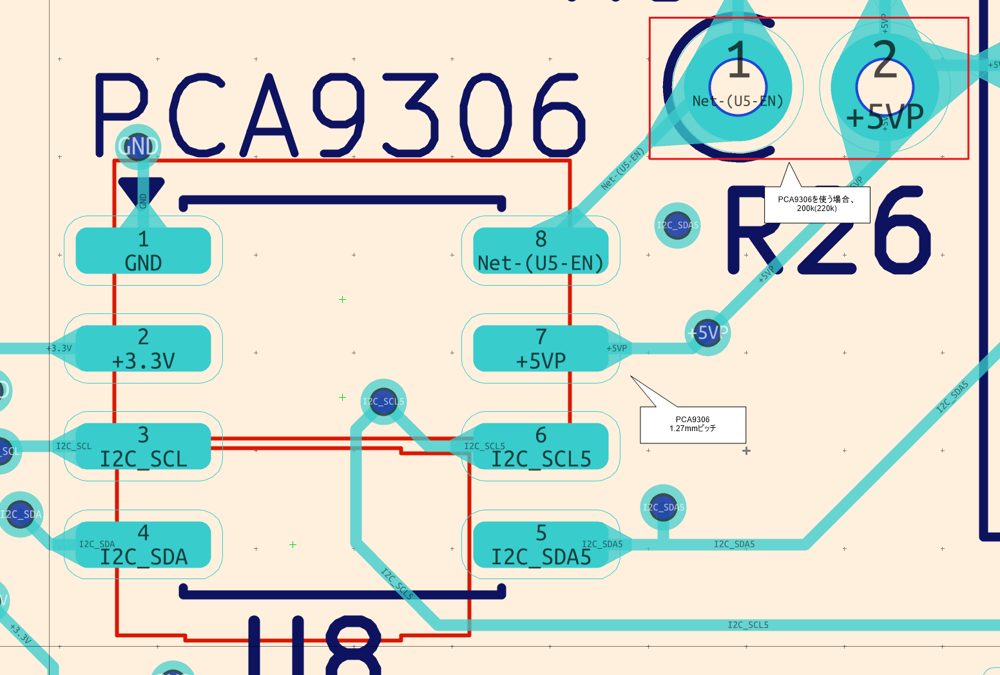 
（ *裏* 面に実装できるパッケージ）
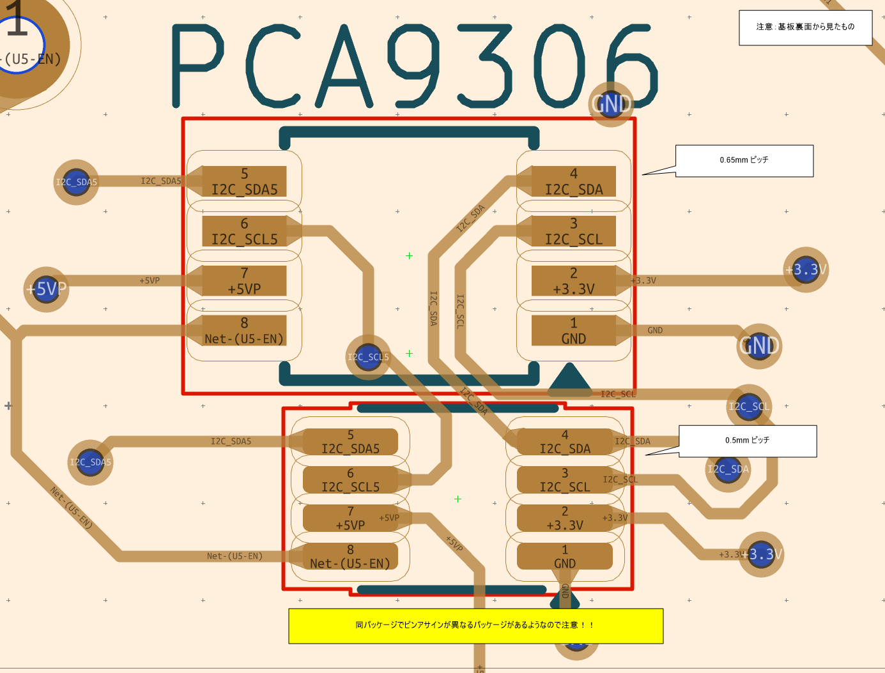 

## 基板修正が必要です!

Vref2を間違えました。使った9306に応じて。　
- 表
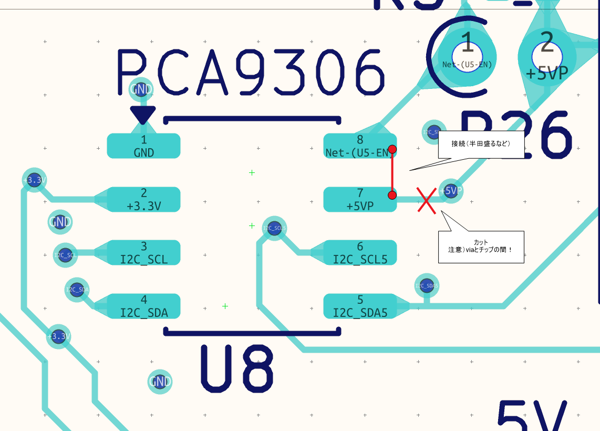 
- 裏
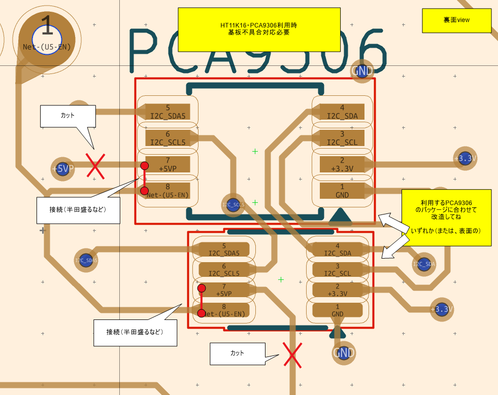

